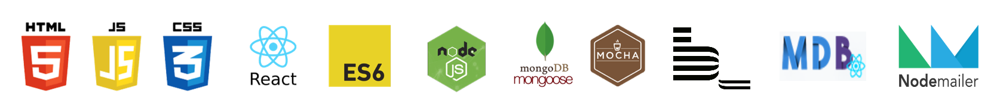
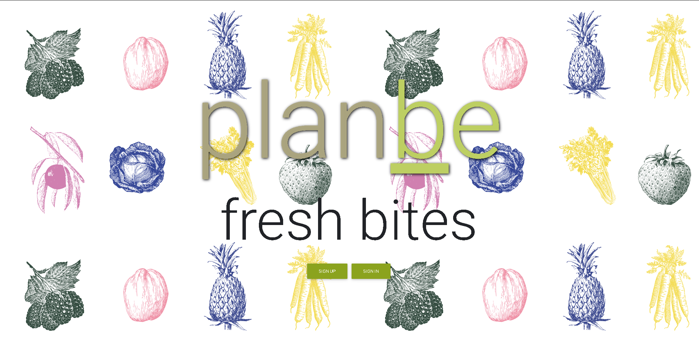
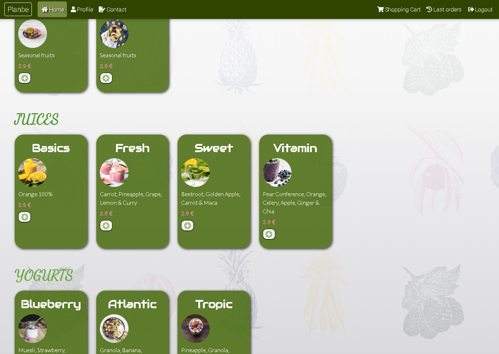
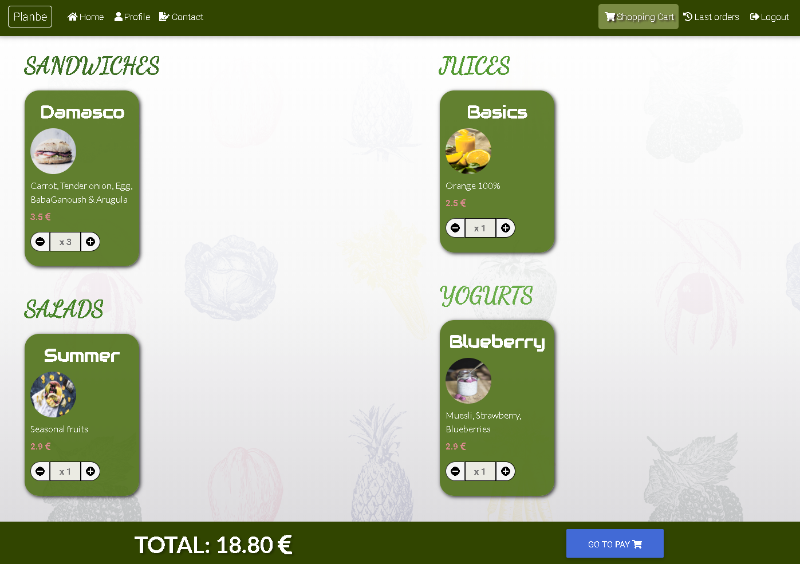
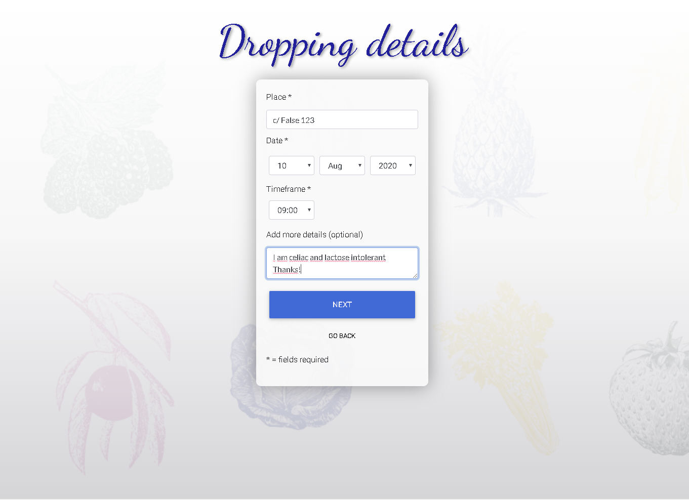
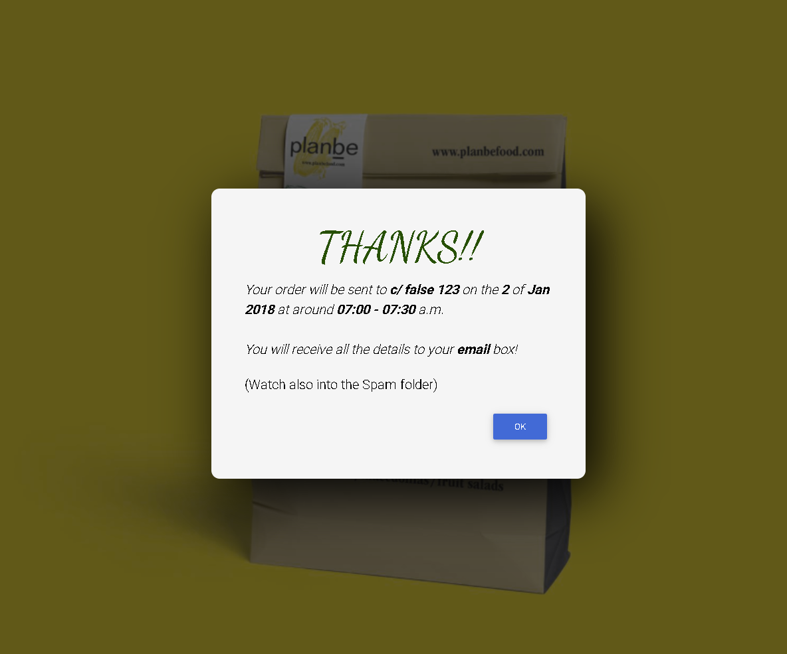

# planbe, _Fresh bites_

**planbe** is a responsive-designed app for an actual company of a friend of mine which prepares sells and delivers breakfasts to the clients.

This App lets the user Register and Login, and only after that it lets to choose among the products the company offers, inform about the dropping place and time and pay it, and finally see the orders.

The client can also edit his profile, contact the company and even receive confirmation emails after registering and finish an order.

This project has been developed during 3 weeks for the presentation of the final project of the bootcamp at [Skylab Coders](https://skylabcoders.com/).

## **Link of Demo:**

To use this App **[click here](http://planbe-freshbites.surge.sh/)**

# Used Technologies



### Backend

- NodeJS, Express, MongoDB, Mongoose, Nodemailer, SendGrid, Mocha, JWT

### Frontend

- ES6, React, Mdbreact, Mocha

**Others**:

- git & github, surge, heroku, creately, draw.io

# Screenshoots

**Landing page:**



**Home page:**



**Cart page:**



**Dropping details page:**



**Confirmation popup**



# Instructions

## Running the application from your device

Clone or download this repo.

**Server**

```
$ cd back
$ npm i
$ npm start
```

**Frontend**

```
$ cd front
$ npm i
$ npm start
```

## Running the tests

**Server**

```
$ cd back
$ mocha logic/index.spec.js
```

**Frontend**

```
$ cd front
$ mocha src/logic.spec.js
```

## More technical documentation

View this second part of the **[documentation](./doc/README.md)**

# Authors

**Pep del Baño [https://github.com/pepdbm7](https://github.com/pepdbm7)**
